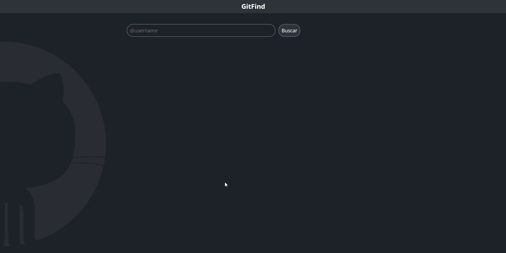

# O projeto ✨

Este projeto foi desenvolvido como parte da atividade do curso "Formação React Developer" da Dio. O objetivo do aplicativo é exibir em tela os dados de um usuário do GitHub por meio da API do GitHub.

O usuário pode inserir o nome do usuário (@username) na barra de pesquisa e, em seguida, serão exibidos os dados desse usuário, como foto do GitHub, nome, bio e todos os repositórios associados a ele.

## Funcionalidades 📝

- Pesquisar usuários do GitHub por nome de usuário
- Exibir foto do GitHub, nome, bio e repositórios do usuário pesquisado

## Tecnologias utilizadas ⚙️

- React
- JavaScript
- HTML
- CSS

## Como executar o projeto 🪄

Certifique-se de ter as seguintes dependências instaladas antes de prosseguir:

- Node.js (versão 18.15.0)

1. Clone este repositório
2. Instale as dependências usando o comando `npm install` ou `yarn install`
3. Execute o comando `npm start` ou `yarn start` para iniciar o aplicativo
4. Acesse o aplicativo em seu navegador através da URL `http://localhost:3000`

## Contato 👨‍💻

Para mais informações, entre em contato pelo meu [LinkedIn](https://www.linkedin.com/in/rafaelrabelodasilva/)